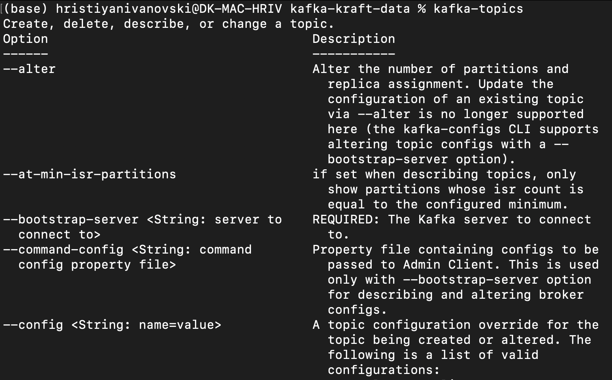
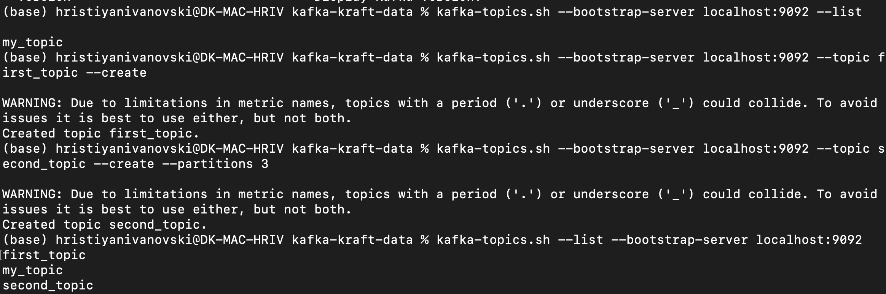
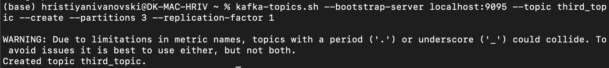
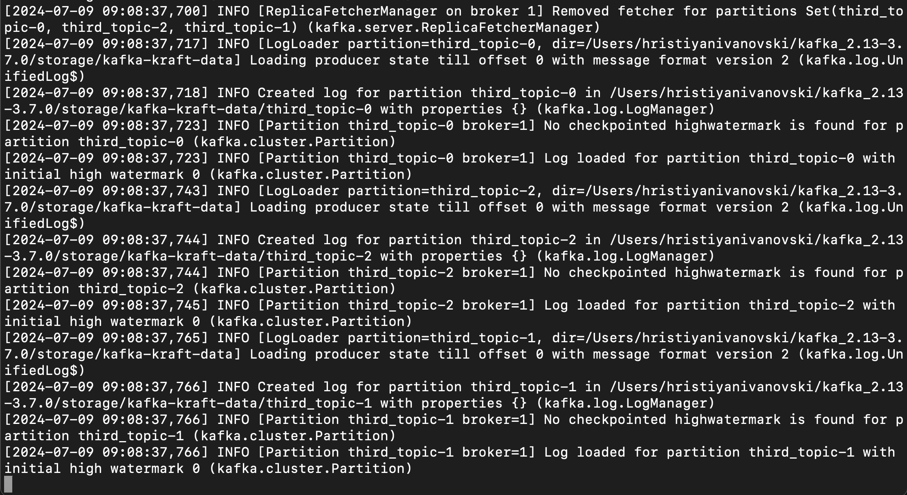
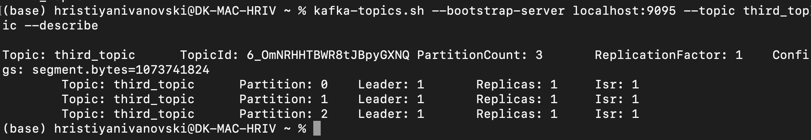
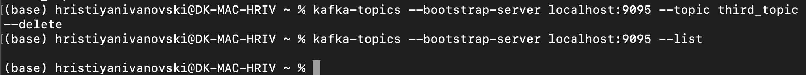
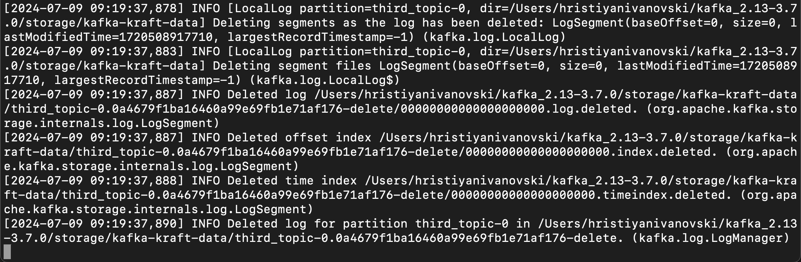

# 
Welcome to my Apache Kafka playground 🏄🏻

### 
Zookeeper ain't a thing no more - start Kafka in Kraft mode

### 
Show topics commands

- in this example, the kafka binaries are added to the PATH so the command does not need to point to the file or to any parent directory

### 
Listing and creating topics (with or without additional parameters like partitions)

Deleting a topic

### 
Producing messages to topic

Describing the topic

