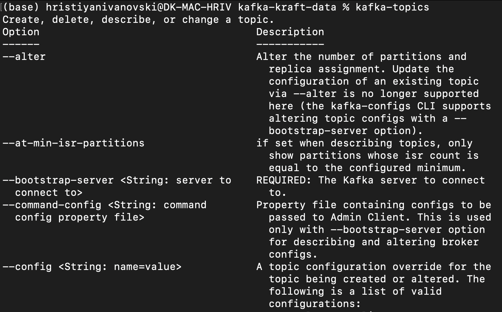

# Welcome to my Apache Kafka playground 🏄🏻

### Show topics commands
- in this example, the kafka binaries are added to the PATH so the command does not need to point to the file or to any parent directory

### Zookeeper ain't a thing no more - start Kafka in Kraft mode

