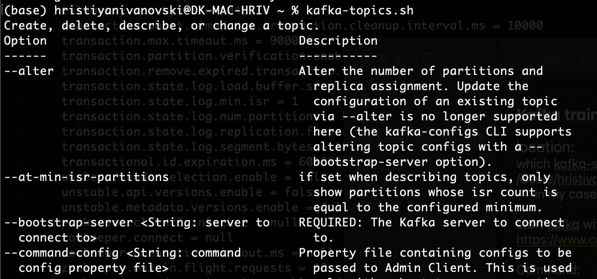

# Kafka quick-start guide

### Start Kafka with Kraft

1. create Kafka data directory
`mkdir data/kafka-kraft`

2. Edit config/kraft/server.properties

- change lines to:
`log.dirs=/your/path/to/data/kafka`
- example:
`log.dirs=/Users/stephanemaarek/kafka_2.13-3.1.0/data/kafka-kraft`

3. find kafka `which kafka-storage.sh`

4. generate storage uid `~/kafka_2.13-3.7.0/bin/kafka-storage.sh random-uuid`

5. format storage `~/kafka_2.13-3.7.0/bin/kafka-storage.sh format -t <storage_uuid> -c ~/kafka_2.13-3.7.0/config/kraft/server.properties`

6. start kafka `~/kafka_2.13-3.7.0/bin/kafka-server-start.sh ~/kafka_2.13-3.7.0/config/kraft/server.properties`

end of output should contain info for server:

- useful docs:

    https://www.conduktor.io/kafka/how-to-install-apache-kafka-on-mac-without-zookeeper-kraft-mode/

### Run kafka-topics.sh command with already set $path to binaries

- NOTE: If you do not have set the path variable to kafka binaries:
    - use the full path in your command 
    - or set it accordingly:
        - `nano ~/.bash_profile`
        - Add `PATH="$PATH:/your/path/to/your/kafka/bin"`
            - Example: `PATH="$PATH:~/kafka_2.13-3.1.0/bin"`

next steps..